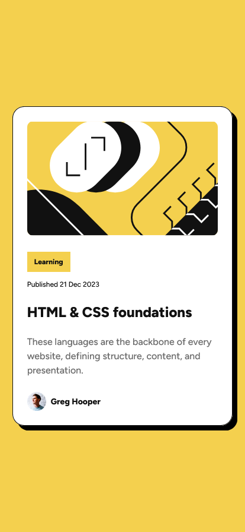

# Frontend Mentor - Blog preview card solution

This is a solution to the [Blog preview card challenge on Frontend Mentor](https://www.frontendmentor.io/challenges/blog-preview-card-ckPaj01IcS). Frontend Mentor challenges help you improve your coding skills by building realistic projects. 

## Table of contents

- [Overview](#overview)
  - [The challenge](#the-challenge)
  - [Screenshot](#screenshot)
  - [Links](#links)
- [My process](#my-process)
  - [Built with](#built-with)
  - [Useful resources](#useful-resources)
- [Author](#author)

**Note: Delete this note and update the table of contents based on what sections you keep.**

## Overview

### The challenge

Users should be able to:

- See hover and focus states for all interactive elements on the page

### Screenshot

### Links

- Solution URL: [GitHub Repository](https://github.com/bruins001/blog-preview-card)
- Live Site URL: [GitHub Pages](https://bruins001.github.io/blog-preview-card)

## My process

### Built with

- Semantic HTML5 markup
- CSS custom properties
- Flexbox

### Useful resources

- [Developer mozilla](https://developer.mozilla.org/en-US/docs/Learn_web_development/Core/Styling_basics)
- [W3Schools](https://www.w3schools.com/)

## Author

- Website - [Niels Bruinsma](https://www.nielsbruinsma.net)
- Frontend Mentor - [@bruins001](https://www.frontendmentor.io/profile/bruins001)
